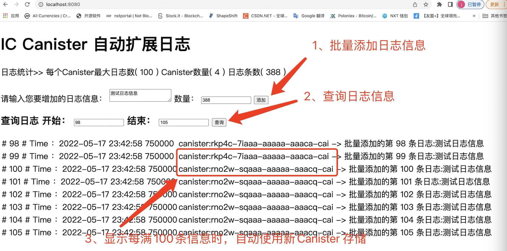

# Ext Logger

Ext Logger 实现了 IC-Logger 的自动扩展功能，当每个 Logger Canister 存放满 100 条记录时，自动创建新的 Logger Canister 来存放新的记录。


## Usage

 * 启动 dfx 服务
```
cd demo
dfx start --clean
```

 * 在新的终端打开，部署canister
```
dfx deploy
```

 * 启动 web前端
```
npm start
```

 * 访问
```
http://localhost:8080/
```

 * 功能展示


